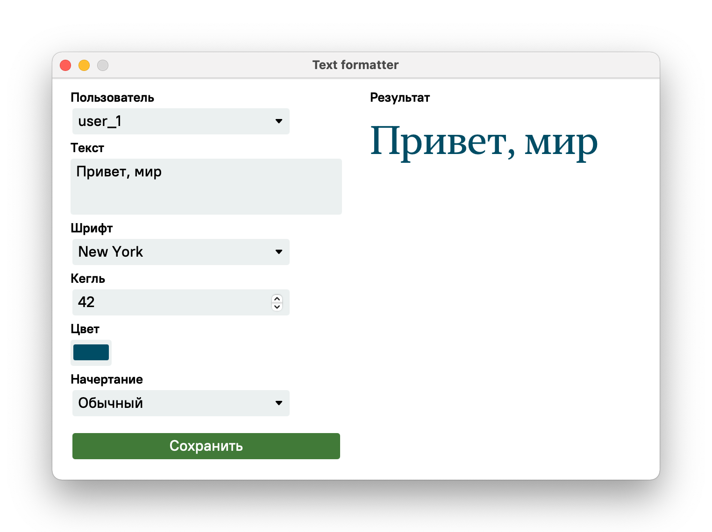

# Text formatter



Приложение для форматирования пользовательского текста. Написано на [Wails](https://wails.io/), Go, Javascript и Redis.

## Технические требования

- MacOS 10.5+
- Go 1.21
- Wails 2.60
- Доступ к каппе :-)

## Задание

Разработать десктопное приложение. Для хранения данных пользователя использовать СУБД Redis.

Реализовать хранение для каждого пользователя списка настроек текстового сообщения: название шрифта, размер шрифта, цвет шрифта, начертание.

Создать оконное приложение, содержащее формы ввода настроек и выбора пользователя, кнопку для сохранения настроек, поле ввода для текста надписи, форматированный текст со стиялми пользователя.

## Запуск

Установить зависимости:

```bash
./script/bootstrap
```

Прокинуть порт к базе данных на сервере ПетрГУ. Пароль и `<username>` от каппы:

```bash
ssh -L 6379:192.168.112.103:6379 -N -T <username>@kappa.cs.petrsu.ru
```

Запустить приложение в режиме разработки:

```bash
./script/run
```

Собрать приложение:

```bash
./script/build
```
